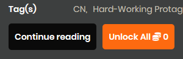
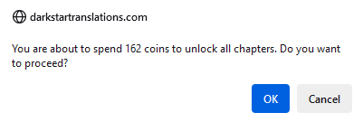
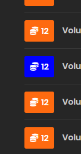

# Ezy-Coin-Spend

Userscript to spend your coins to unlock chapters easily.

## Table of Contents

- [Introduction](#introduction)
- [Tested Environments](#tested-environments)
- [Working Sites](#working-sites)
- [Installation](#installation)
- [Usage](#usage)
- [Contributing](#contributing)
- [License](#license)

## Introduction

Ezy-Coin-Spend is a userscript designed to help you spend your coins to unlock chapters easily on supported websites.

- Adds clickable buttons for each chapter to immediately unlock desired chapters without visiting the chapters.
- Adds a button to unlock all locked chapters.

  

  

  

  

## Tested Environments

Should work with every modern browser with tampermonkey.

- Firefox, Tampermonkey

> [!TIP]
> Should work with every modern browser with tampermonkey.

## Working Sites

- [Hiraeth Translation](https://hiraethtranslation.com/)
- [Darkstar Translations](https://darkstartranslations.com/)

Feel free to suggest more or create pull requests.

## Installation

1. Install a userscript manager like Tampermonkey.
2. Add the Ezy-Coin-Spend userscript from [GitHub](https://github.com/Salvora/Novel-Ezy-Coin/raw/refs/heads/main/Ezy-Coin-Spend.user.js).

## Usage

Once installed, the script will automatically run on the supported sites. You can unlock chapters by clicking on the coin elements or unlock all of them with the button.

This script is designed to prevent spending more than required. Please, report any oversights. (I wasted a lot of coins to prevent double spending.) 

## Contributing

Contributions are welcome! Please open an issue or submit a pull request on [GitHub](https://github.com/Salvora/Novel-Ezy-Coin).

## License

This project is licensed under the GNU General Public License v3.0. See the [LICENSE](LICENSE) file for details.